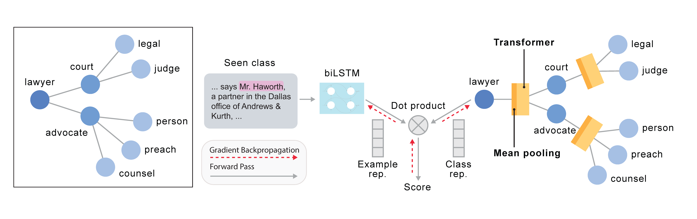

# ZSL-KG
ZSL-KG is a general-purpose zero-shot learning framework with a novel transformer graph convolutional network (TrGCN) to learn class representation from common sense knowledge graphs.

[](https://app.travis-ci.com/github/BatsResearch/zsl-kg)

Reference paper: [Zero-shot Learning with Common Sense Knowledge graphs](https://arxiv.org/abs/2006.10713).



## Performance
Performance ZSL-KG compared to other existing graph-based zero-shot learning frameworks.


|    Method        | Ontonotes (Strict) | BBN  (Strict)| SNIPS-NLU  (Acc.)   | AWA2  (H)   | aPY   (H)   | ImageNet (All T-1) | Avg.     |
|------------------|--------------------|--------------|---------------------|-------------|-------------|----------|----------|
| GCNZ             | 41.5               | 21.5         | 82.5                | 73.3        | 58.1        | 1.0      | 46.3     |
| SGCN             | 42.6               | 24.9         | 50.3                | 73.7        | 56.8        | 1.5      | 41.6     |
| DGP              | 41.1             | 24.0         | 64.4                | **75.1**    | 55.7        | 1.4      | 43.6     |
| **ZSL-KG**       | **45.2**           | **26.7**     | **89.0**            | 74.6        | **61.6**    | **1.7**  | **49.8** |

ZSL-KG outperforms existing graph-based frameworks on five out of six benchmark datasets.

For more details on the experiments, refer to [nayak-tmlr22-code](https://github.com/BatsResearch/nayak-tmlr22-code).
## Installation
The package requires `python >= 3.7`. To install the package, type the following command:
```
pip install .
```

## Example Usage
In our framework, we use `AutoGNN` to easily create graph neural networks for zero-shot learning.

```python
from zsl_kg.class_encoder.auto_gnn import AutoGNN
from zsl_kg.common.graph import NeighSampler

trgcn = {
    "input_dim": 300,
    "output_dim": 2049,
    "type": "trgcn",
    "gnn": [
        {
            "input_dim": 300,
            "output_dim": 2048,
            "activation": nn.LeakyReLU(0.2),
            "normalize": True,
            "sampler": NeighSampler(100, mode="topk"),
            "fh": 100,
        },
        {
            "input_dim": 2048,
            "output_dim": 2049,
            "activation": None,
            "normalize": True,
            "sampler": NeighSampler(50, mode="topk"),
        },
    ],
}

class_encoder = AutoGNN(trgcn)
```

Our framework supports the following graph neural networks: `gcn, gat, rgcn, lstm, trgcn`.
You can change the `type` to any of the available to graph neural networks to instantly create a new graph neural network.

For more examples, refer to [nayak-tmlr22-code](https://github.com/BatsResearch/nayak-tmlr22-code).

## Run Tests
To run the tests, please type the following command:
```
pytest
```

## Citation
Please cite the following [paper](https://arxiv.org/abs/2006.10713) if you are using our framework.

```
@article{nayak:tmlr22,
  Author = {Nayak, N. V. and Bach, S. H.},
  Title = {Zero-Shot Learning with Common Sense Knowledge Graphs},
  Journal = {Transactions on Machine Learning Research (TMLR)},
  Year = {2022}}
```
